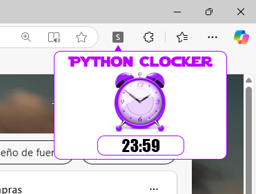
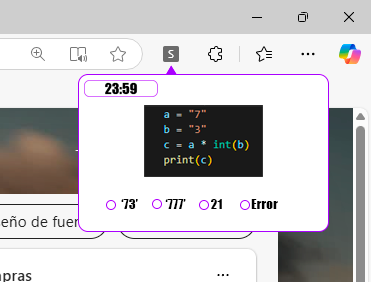

Aarón Neupaver Montiel
# PythonClocker

## ¿En qué consiste?
Esta idéa, surge cuando un chico de 18 años empezó a estudiar programación, todo era muy bonito pero.... Python, ese lenguaje interpretado a veces facil, pero otras una completa pesadilla.
Así que aquí tienes tu solución!!
Esta extensión para su navegador le salvará su asignatura, un despertador que para poder pararlo, necesitas resolver el programa.

## Significado de extensión
Las extensiones son pequeños programas de software que personalizan la experiencia de navegación. Permiten a los usuarios adaptar la funcionalidad y el comportamiento del navegador a las necesidades o preferencias individuales.

## Previsualización

## Funcionamiento

En esta imagen de aqui, lo primero que tendremos que hacer es presionar sobre el minilogo de la extensión para que se nos abra el desplegable de nuestra app, una vez abierta, observaremos que en la parte inferior hay un recuadro, donde escribiremos la hora que queremos ponernos a estudiar programación y ya sabemos que no hay mejor manera de romper el hielo que empezando a programar al momento, en este caso con un despertador.

Una vez  sea la hora marcada, saldrá esta ventanita de aquí.

La cual solo tendremos que poner la opción correcta para que se apague la alarma, **'los programas son aleatorios'**.

## Lenguajes que contendrá nuestra extensión
Por ahora, solo nos bastará on **JavaScript**, **Json**, **HTML5** y **CSS3**.
Para nuevas implementaciones de lenguaje, se modificarán aquí en este documento.

  
  
  
  
  

